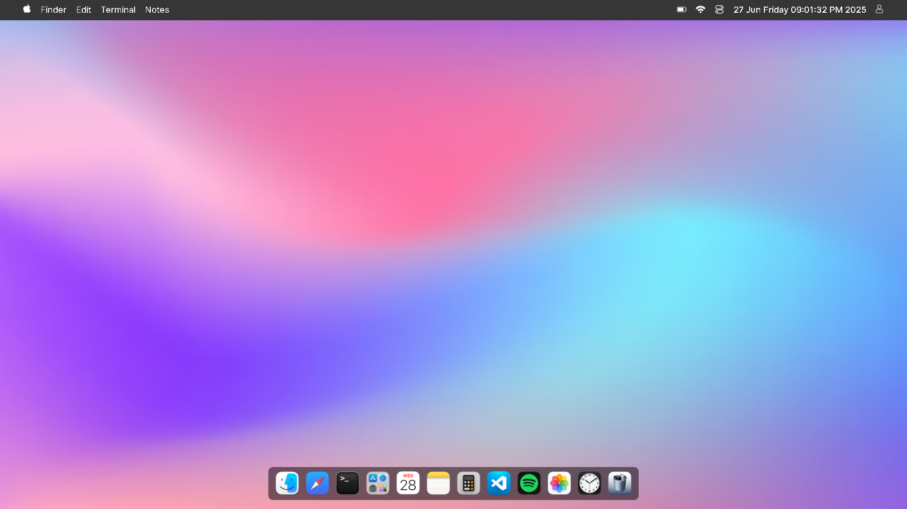

# 💻 MacOS Web UI Clone

A fully responsive, interactive **MacOS-style web UI clone** built with HTML, SCSS, and JavaScript. This project replicates the look and feel of a macOS desktop environment with working apps like Finder, Terminal, Calculator, Notes, Gallery, Safari browser, Clock, Trash Bin, and more.

---

## 🚀 Features

- 📂 **Finder (File Manager)** – Navigate between folders, create new folders dynamically.
- 🖥️ **Terminal** – Simulated UI with maximize/minimize/close controls.
- 📒 **Notes App** – Minimal notes UI with editable content.
- 🧮 **Calculator** – Perform arithmetic operations with a clean UI.
- 🖼️ **Gallery App** – View a grid of images in mac-style layout.
- 🌐 **Safari Browser UI** – Search input and simulated webpage section.
- ⏰ **Clock App** – Digital real-time clock with adjustable sizing.
- 🗑️ **Bin (Trash)** – Styled to match macOS look; shows "Empty" message.
- 🧭 **Dock** – Interactive launcher for accessing apps.
- 🖱️ **Right-Click Context Menu** – Custom menu with options like Create Folder.
- 🔍 **Edit Menu** – Undo, Cut, Copy, Paste, Select All, and Search field.
- 🖼️ **Glassmorphism + Transitions** – Smooth visual polish using SCSS.

---

## 🛠️ Technologies Used

- HTML5
- SCSS (with Mixins and Transitions)
- Vanilla JavaScript (DOM manipulation, event handling)

---

## 📸 Screenshots

## 🤝 Contributing

Contributions are welcome! Fork the repo, make changes, and open a pull request.

---

